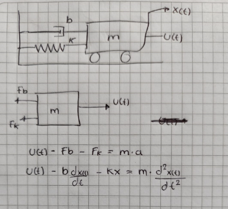

# Modelamientos de Sistemas 
El modelamientos de sistemas de control es uno de los pasos mas importantes para un b uen analisis y diseño en sistemas de control, pues este nos ayuda a representar por medio de las matematicas yn comportamiento dinamico de algun sistema en especifico meduante ecuaciones, estas asu vez nos ayudan a ver el cambio de sus variables a travez del tiempo.
## Principio General del Modelamiento
Como se dijo anteriomente el modelamiento de un sistema consiste en representarlo mediante un conjunto de ecuaciones o relaciones matematica con el fin de describir su comportamiento atraves del tiempo para si poder analizar y predecir como va a responder ante diferentes condiciones para ello varios de los principos son:
### Conservacion de leyes fundamentales como:
Leyes de Newton (para sistemas mecánicos),
Leyes de Kirchhoff (para circuitos eléctricos),
Leyes de conservación de masa, energía y momento.
### Causalidad 
Esta establece la relacion etre casusa y efecto donde influyen tanto las entradas como las salidas del sistema anlizado esto atraves de unos procesos internos.
### Linialidad o no linialidad 
Esto  nos dira si el sistema se comporta de forma lineal en el tiempo o no ya que pueden haber sistemas los cuales cambien demaciado su estructura durante el transcurso del mismo.
## Como lucen los modelos de ecuaciones diferenciales
Estos son conbinaciones de derivadas de difernte orden su exprecion general esta dada de la siguiente forma:

$$a_{1}\frac{\partial^2 f }{\partial t^2}+a_{2}\frac{\partial f}{\partial t}+a_{3}f=u(t)$$

Donde F es la salida del Sistema,U es la entrada del Sistema,La solución no es un número es una función, gracias a este tipo de funciones podemos ver y analizar los sistemas.

## Sistemas Mecanicos 
Son aquellos sistemas que estan diseñados con utencilios como resortes, amortiguadores, estos a su vez conectados a una masa o superficie, son sistemas los cuales no llevan nada electrico y aparte de eso tambien pueden ser rotativos o combinados su escructura es

Para el analizis de estos sistemas nos vasamos en fenomenos fisicos tales como la ley de hooke:

$$F_{R}=K*x$$

La friccion viscosa 

$$F_{f}=b*v_{m}$$

y las leyes de newton 

$$F=m*a$$

Para la solucion de los ejercicios se empesara con el analizis para asi saber como comenzaremos las ecuaciones, para el caso de un sistema de masa resorte amortiguador aplicaremos el diagrama de cuerpo libre para la masa y a si vmermos las fuerzas aplicadas para la ecuacion para la imaguen anterior es como se muestra a continuacion:

